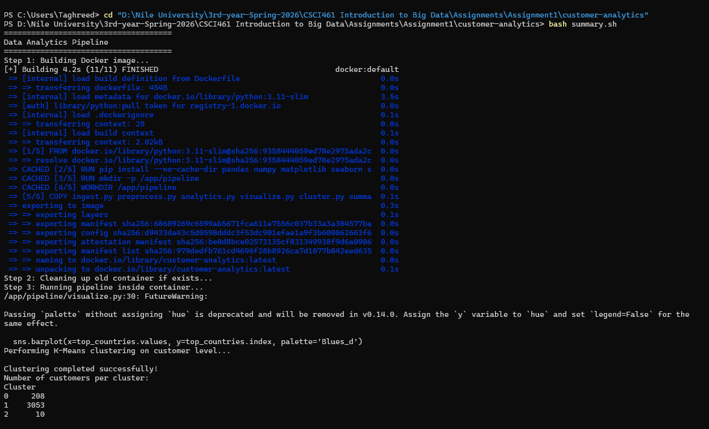
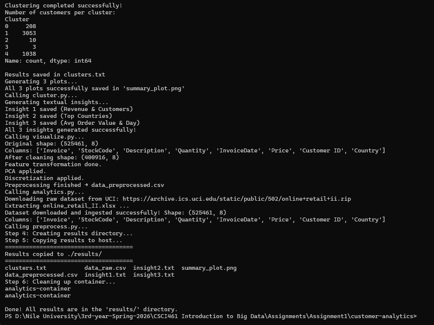
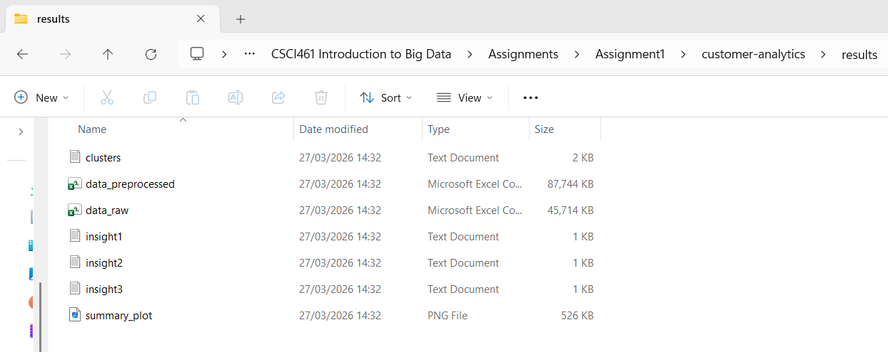
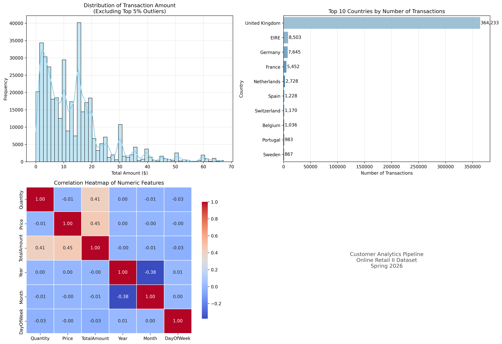

# Customer Analytics Pipeline — CSCI461 Assignment 1

## Team Members
| Name | Student ID |
|------|------------|
| Farah Awadalla | 231000006 |
| Taghreed Oyoun | 231002478 |

---

## Dataset
- **Name:** Online Retail II
- **Source:** UCI Machine Learning Repository
- **Link:** https://archive.ics.uci.edu/dataset/502/online+retail+ii
- **Description:** Raw transactional data from a UK-based online retail company (2009–2011), containing invoices, products, quantities, prices, and customer IDs.

---

## What Farah Implemented
- **Dockerfile** — Base image `python:3.11-slim`, installs all required packages, sets up `/app/pipeline/` as working directory
- **ingest.py** — Downloads the Online Retail II dataset from UCI, extracts the Excel file from the zip, and saves it as `data_raw.csv`
- **preprocess.py** — Full preprocessing pipeline:
  - *Data Cleaning:* removes duplicates, drops cancelled invoices, drops rows with missing Customer ID, filters invalid quantities/prices
  - *Feature Transformation:* creates `TotalAmount`, encodes `Country`, extracts date features (Year, Month, DayOfWeek), scales numeric columns with StandardScaler
  - *Dimensionality Reduction:* applies PCA (2 components) on Quantity, Price, TotalAmount
  - *Discretization:* bins `TotalAmount` into 5 categories and `Quantity` into 4 categories

## What Taghreed Implemented
- **analytics.py** — Generates 3 textual insights from the preprocessed data:
  - `insight1.txt`: Total revenue and number of unique customers
  - `insight2.txt`: Top 5 countries by revenue
  - `insight3.txt`: Average order value and most frequent purchase day
- **visualize.py** — Generates 3 meaningful plots saved as `summary_plot.png`:
  - Histogram of transaction amounts (excluding top 5% outliers)
  - Horizontal bar chart of top 10 countries by number of transactions
  - Correlation heatmap of numeric features
- **cluster.py** — Applies K-Means clustering (k=5) using RFM (Recency, Frequency, Monetary) features, labels each cluster, and saves results to `clusters.txt`
- **summary.sh** — Copies all output files (`.csv`, `.txt`, `.png`) from the container to `results/` on the host, then stops and removes the container

---

## Project Structure
```
customer-analytics/
├── Dockerfile
├── ingest.py
├── preprocess.py
├── analytics.py
├── visualize.py
├── cluster.py
├── summary.sh
├── README.md
└── results/
    ├── data_raw.csv
    ├── data_preprocessed.csv
    ├── insight1.txt
    ├── insight2.txt
    ├── insight3.txt
    ├── summary_plot.png
    └── clusters.txt
```

---

## Execution Flow

```
ingest.py
   └──> preprocess.py
            └──> analytics.py
                     └──> visualize.py
                               └──> cluster.py
```

Each script automatically calls the next one using `subprocess.call()`.

---

## Docker Build & Run Commands

### Option A — Run everything with one command (recommended)
```bash
bash summary.sh
```
This automatically builds the image, runs the full pipeline inside the container, copies all results to `results/`, and removes the container.

### Option B — Run manually step by step

**1. Build the Docker image**
```bash
docker build -t customer-analytics .
```

**2. Run the container and execute the pipeline**
```bash
docker run --name analytics-container customer-analytics python ingest.py
```

**3. Copy results to host and clean up**
```bash
bash summary.sh
```

---

## Screenshots

### Terminal Output — Pipeline Running



### Results Folder on Host


### summary_plot.png — Generated Visualizations


---

## Sample Outputs

### insight1.txt
```
Total Revenue: $8,798,233.74
Total Unique Customers: 4312
```

### insight2.txt
```
Top 5 Countries by Revenue:
United Kingdom    7,381,644.43
EIRE                356,041.86
Netherlands         268,784.35
Germany             202,025.39
France              146,107.07
```

### insight3.txt
```
Average Order Value: $457.93
Most Frequent Purchase Day: Thursday
```

### clusters.txt
```
CUSTOMER SEGMENTATION USING K-MEANS CLUSTERING (RFM Analysis)
======================================================================
Number of clusters used: 5
Total customers analyzed: 4312

Cluster 0: Regular Customers
   Number of Customers : 208
   Avg Recency         : 16.77 days
   Avg Frequency       : 21.76 orders
   Avg Monetary Value  : $12,210.23
--------------------------------------------------
Cluster 1: Occasional / Low-Value Customers
   Number of Customers : 3053
   Avg Recency         : 44.7 days
   Avg Frequency       : 3.77 orders
   Avg Monetary Value  : $1,370.06
--------------------------------------------------
Cluster 2: Frequent High-Spenders
   Number of Customers : 10
   Avg Recency         : 3.7 days
   Avg Frequency       : 118.1 orders
   Avg Monetary Value  : $66,250.55
--------------------------------------------------
Cluster 3: VIP / Top-Tier Customers
   Number of Customers : 3
   Avg Recency         : 6.0 days
   Avg Frequency       : 89.67 orders
   Avg Monetary Value  : $264,703.53
--------------------------------------------------
Cluster 4: Churned / Inactive Customers
   Number of Customers : 1038
   Avg Recency         : 243.86 days
   Avg Frequency       : 1.66 orders
   Avg Monetary Value  : $596.43
```
